# 🧪 Full Spectrum Testing – README (Tests)

This document explains the testing strategy for the Book App project.
It covers the **types of tests, tools used**, and how **the tests are automated** in GitHub Actions CI/CD pipelines.

---

## 🚀 Getting Started

### Clone and install:

```bash
git clone https://github.com/hossainks/full-spectrum-testing.git
cd full-spectrum-testing
npm install
(cd test-e2e && npm install)
```

### Start services (Docker Compose):

```bash
docker compose up -d --build
```

The app will be available at: [http://localhost:3000](http://localhost:3000)

---

## 📂 Project Structure (Tests Only)

```
tests/
├── unit/              # Jest unit tests (mocked models)
├── integration/       # Supertest-based integration tests
├── api/               # Postman collections (Newman)
├── mock-data/         # Static test data
test-e2e/              # Playwright tests + config
```

---

## 🧪 Test Types

* **Unit Tests (Jest + Coverage)**

  * Lightweight tests for controllers & services
  * Mocks DB layer
  * Run with coverage reporting

* **Integration Tests (Jest + Supertest)**

  * Spin up app with Docker
  * Test API endpoints against MongoDB

* **API Tests (Postman + Newman)**

  * Validate API flows using Postman collection
  * Runs in CI after integration tests

* **Performance Tests (k6)**

  * Runs in a **separate repository** (`k6-performance-test`)
  * Triggered via **GitHub Actions repository_dispatch**
  * Thresholds, custom metrics, and HTML summary reports

* **E2E Tests (Playwright)**

  * Full browser-based tests
  * Runs in parallel with k6 workflow
  * Generates Playwright HTML report

---

## 🔄 CI/CD Test Workflow

```mermaid
flowchart TD
    A["Unit Tests<br/>(Jest + Coverage)"] --> B["Integration Tests<br/>(Jest + Supertest)"]
    B --> C["API Tests<br/>(Newman)"]
    C --> D["Performance Tests<br/>k6 Repo Trigger"]
    C --> E["E2E Tests<br/>(Playwright)"]

    D --> F["✅ Results collected<br/>(Artifacts + Reports)"]
    E --> F

```



---

## 📊 CI/CD Reporting

* **Unit Tests** → JUnit + Coverage reports uploaded as artifacts
* **Integration Tests** → JUnit reports
* **API Tests** → Newman reports
* **Performance Tests** → HTML + JSON summaries from k6 repo
* **E2E Tests** → Playwright HTML reports + JUnit XML


### 5️⃣ End-to-End (E2E) Tests

* Tool: **Playwright**
* Scope: UI tests from browser.
* Config: Located in `test-e2e/`
* Command:

  ```bash
  npx playwright test
  ```
* CI/CD:

  * Runs on **Ubuntu runners**.
  * Installs browsers with `npx playwright install --with-deps`.
  * Publishes HTML & JUnit reports.

---

## ⚙️ CI/CD Pipeline (GitHub Actions)

Here’s how the test pipeline runs step by step:

1. **Unit Tests** → run in isolation, publish coverage & reports.
2. **Integration Tests** → run with Docker (app + MongoDB).
3. **API Tests** → run Postman collections once unit & integration pass.
4. **Performance Tests (k6)** → triggered in external repo, waits for result.
5. **E2E Tests (Playwright)** → final stage, runs UI scenarios.

Each stage uploads results as **artifacts** and publishes them in the GitHub UI.

---

## 📊 Reporting

* **Unit & Integration tests**: JUnit XML + Coverage reports
* **API tests**: Newman console reports
* **Performance tests**: k6 dashboards (Grafana/InfluxDB optional)
* **E2E tests**: Playwright HTML reports + JUnit XML

---

## 🚀 Key Highlights

* Full **testing pyramid** implementation: Unit → Integration → API → Performance → E2E.
* Uses **modern tools**: Jest, Supertest, Newman, k6, Playwright.
* CI/CD integrated with **GitHub Actions** including artifacts & reports.
* **Performance tests in external repo** with trigger + wait mechanism.
* Production-grade **reporting & coverage visibility**.
---

👉 This testing setup ensures confidence across **code quality**, **API stability**, **system performance**, and **user experience**.